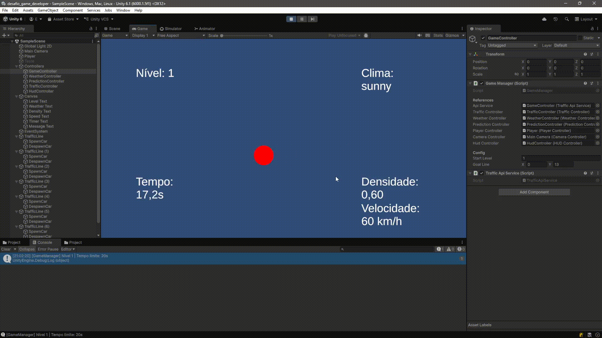

# VBL Smart Crossing

Protótipo desenvolvido como desafio técnico para a vaga de Game Developer no
Centro de Pesquisas Avançadas Wernher von Braun.

Simulador de travessia de via expressa inspirado no Frogger, orientado por
dados de uma API de tráfego e clima em tempo real.

---

## Pré-requisitos

- Unity 2022.3 LTS ou superior
- .NET / C# (incluso no Unity)
- [Mockoon](https://mockoon.com) *(opcional — apenas para mock via HTTP)*

> O projeto usa o .gitignore oficial do Unity (github/gitignore).
> Pastas como `Library/`, `Temp/` e `Logs/` são regeneradas automaticamente
> pelo Unity ao abrir o projeto — isso é esperado.

---

## Como rodar o projeto

### Opção 1 — Mock local (recomendado, sem dependência externa)

1. Clone o repositório
```bash
   git clone https://github.com/Chiaratto12/Desafio-Game-Developer--Centro-Von-Braun
```
2. Abra o projeto no Unity Hub
5. Pressione **Play** no inspetor.

O jogo carregará os dados de `Assets/Resources/mock_response.json`.

---

### Opção 2 — Mock via Mockoon (simula chamada HTTP real)

1. Instale o [Mockoon](https://mockoon.com)
2. Importe o ambiente: `File > Open environment` → selecione `mockoon_env.json`
   na raiz do repositório
3. Clique em **Start server** (porta padrão: `3000`)
5. Pressione **Play**

O Unity fará `GET http://localhost:3000/v1/traffic/status` a cada novo nível.

---

## Controles

| Tecla | Ação |
|---|---|
| `W` / `↑` | Mover para frente |
| `S` / `↓` | Mover para trás |
| `A` / `←` | Mover para a esquerda |
| `D` / `→` | Mover para a direita |
| `R` | Reiniciar após Game Over |

---

## Demonstração



---

## Arquitetura do projeto
```
Assets/Scripts/
├── Core/
│   ├── GameManager.cs          # FSM: Boot → Loading → Playing → Win/GameOver
│   ├── WeatherController.cs    # Multiplicadores de clima
│   └── PredictionController.cs  # Agendamento de predições futuras
├── Data/
│   ├── TrafficApiService.cs    # HTTP + fallback mock local
│   └── Models/
│       └── TrafficData.cs  # DTOs espelhando o contrato OpenAPI
├── Scenario/
│   ├── Vehiclecontroller.cs    # Controle do veículo até seu destino final
│   └── TrafficController.cs    # Spawn e velocidade de veículos
├── Player/
│   ├── PlayerController.cs     # Movimento por grid + colisão
│   └── CameraController.cs     # Segue avanço máximo do jogador no eixo Y
└── UI/
    └── HUDController.cs        # Nível, dados da API e timer em tempo real
```

## Fórmulas implementadas

Conforme especificação VBL:

- **Spawn**: `Intervalo (s) = 1 / vehicleDensity`
- **Velocidade**: `Velocidade_Unity = (averageSpeed / 100) * ReferênciaVisual`
- **Clima** (multiplicador na velocidade do player):
  - `sunny` → 1.0x
  - `clouded` / `foggy` → 0.8x
  - `light rain` → 0.6x
  - `heavy rain` → 0.4x
- **Timer**: tempo limite = `estimated_time` da última entrada de `predicted_status`

---

## Decisões técnicas

**Movimento por grid em 2D**
Optei por movimento discreto célula a célula no eixo Y para garantir
colisões determinísticas. Veículos se movem de forma contínua e autônoma —
a colisão é detectada comparando a célula calculada de cada veículo com a
posição atual do player, evitando falsos negativos que ocorrem com física
contínua em velocidades altas.

**Separação de camadas**
Os DTOs em `Data/Models/` não têm nenhuma dependência de UnityEngine.
Isso permite testar a deserialização do JSON isoladamente sem precisar
subir a engine.

**Fallback de API**
Se a chamada HTTP falhar, o jogo carrega o JSON local automaticamente
sem travar. O avaliador consegue testar sem configurar o Mockoon.

**PredictionScheduler com Coroutines**
As predições futuras são agendadas com `WaitForSeconds` usando o
`estimated_time` convertido de ms para segundos. O scheduler cancela
todos os agendamentos anteriores ao iniciar um novo nível, evitando
que predições de níveis passados vazem para o estado atual.

---

## Limitações conhecidas

- Efeitos visuais de clima (partículas de chuva, névoa) não implementados
  por serem opcionais no escopo do protótipo — os multiplicadores de
  gameplay estão funcionais.
- A detecção de vitória é colocada no prórpio script — em níveis futuros
 isso poderia ser configurável via API.

---

## Como o projeto escala

Cada novo nível faz uma nova chamada à API, então cenários completamente
diferentes podem ser servidos sem alterar o cliente — basta o servidor
retornar dados diferentes. O `PredictionScheduler` agenda as mudanças
automaticamente independente de quantas predições o array contiver.